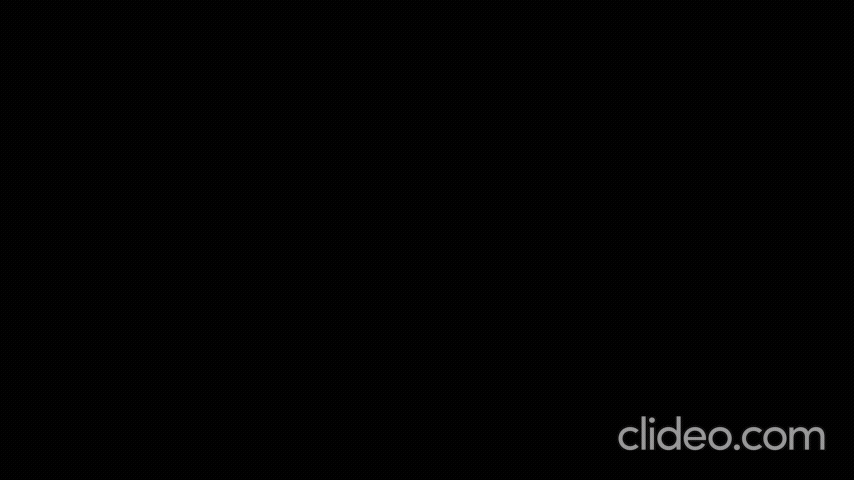

File Summary

circular_drive_env.py: Environment implementation (Gym-like) for driving in an annular ring. Contains physics (position, heading, steering), observation/action spaces, reward computation, termination/truncation logic, and Pygame-based rendering. Key routines: reset(), step(action), _get_state(), render(), close(). Note: reward balances radial and heading errors; actions are a dict with "speed" and "steer_rate".

ppo_model.py: Neural network ActorCritic (PyTorch) shared trunk with separate heads: discrete speed logits (speed_head), continuous steering mean (steer_mean) with learned log-std (steer_log_std), and a value head (value_head). forward(x) returns (speed_logits, steer_mean, steer_std, value).

policy.py: High-level policy wrapper PPOPolicy that holds the ActorCritic network and optimizer. Provides:

act(state): samples discrete speed and continuous steer, returns action + log-prob + value. (I patched this file to ensure correct batching and shape handling: act() now ensures a batch dim and squeezes steering tensors before computing log-probs.)
evaluate(states, speed_actions, steer_actions): returns joint log-probs, values, and entropy for PPO updates (also patched to align steer shapes and squeeze mean/std).
buffer.py: RolloutBuffer storing rollout data tensors (states, actions, rewards, dones, values, log_probs, advantages, returns). Methods:

add(...) to append a transition,
compute_gae(last_value, gamma, lam) to compute advantages via GAE,
normalize_advantages() to standardize advantages.
Stores tensors on configured device.
ppo_trainer.py: PPOTrainer implements PPO update loop:

Gathers minibatches from RolloutBuffer,
Calls policy.evaluate(...),
Computes clipped policy loss, value loss, entropy bonus,
Backprop + gradient clipping + optimizer step.
Key hyperparams: clip range, epochs, batch size, entropy/value coeffs.
training_custom_ppo.py: Main training script that:

Creates CircularDriveEnv, PPOPolicy, PPOTrainer, RolloutBuffer,
Runs environment to fill rollouts (ROLL_SIZE), calls compute_gae() and trainer.train(buffer),
Saves model to ppo_car.pt.
Useful for full experiments and logging mean buffer reward/advantage each update.
test_policy.py: Small script to load saved weights (ppo_car.pt) into PPOPolicy, run the env in render mode, and step using deterministic selections (argmax for discrete speed, mean for steering). Handy for qualitative evaluation and visualization.

run_env.py: Simple harness to run the environment with a fixed, ideal steering delta (diagnostic for physics correctness). Prints state (v, delta, theta, radius, deltas) and renders — useful to sanity-check environment dynamics.

ppo_car.pt: Model weights saved by training_custom_ppo.py (binary). Load with torch.load(..., map_location=DEVICE) as used in test_policy.py.

driving: Project virtualenv (contains Python binary and site-packages used for tests). Use its Python to run scripts with correct deps.

How the pieces interact (brief):

training_custom_ppo.py runs CircularDriveEnv and uses policy.PPOPolicy (wraps ppo_model.ActorCritic) to collect rollouts into RolloutBuffer. After GAE, it calls ppo_trainer.PPOTrainer.train(buffer) to update policy.net. test_policy.py loads saved weights and uses policy.act() to run the environment for visualization. run_env.py isolates environment physics.
Notable fixes I applied:

policy.py: fixed batching and tensor shape mismatches in act() and evaluate() so log-prob and distribution shapes align (prevents runtime shape errors and NaNs during training).

